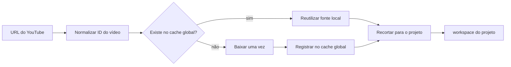

# Desenvolvimento — cache global de vídeos YouTube

## Objetivo

Evitar downloads repetidos do mesmo vídeo entre projetos. O arquivo-fonte
baixado do YouTube deve ser compartilhado globalmente; somente o recorte da
cena e os artefatos derivados pertencem ao workspace de cada projeto.



## Separação de armazenamento

```text
C:\generator\media_cache\youtube\
  <video_id>\
    source.mp4
    metadata.json
    poster.jpg

C:\generator\workspace\
  process\source\original.mp4       # link/referência temporária ao cache
  process\output\scene_video.mp4    # recorte exclusivo do projeto
  process\output\scene_audio_16k_mono.wav
```

`media_cache` não pertence a nenhum projeto e não pode ser apagado ao trocar,
resetar ou excluir um projeto. `workspace/` e `projects/<id>/workspace/`
guardam somente o recorte, áudio da cena e documentos de revisão daquele
projeto.

## Identidade do cache

A chave primária é o **YouTube video ID** de 11 caracteres, extraído de URLs
normais, curtas, embed e shorts. A URL original é metadado; URLs diferentes que
apontam para o mesmo ID reutilizam o mesmo download.

O cache também registra a variante baixada para evitar usar uma cópia inferior
quando a política do projeto exigir outra qualidade:

```json
{
  "schema": "generator-youtube-media-cache",
  "schema_version": "1.0",
  "video_id": "dQw4w9WgXcQ",
  "canonical_url": "https://www.youtube.com/watch?v=dQw4w9WgXcQ",
  "source_file": "source.mp4",
  "sha256": "...",
  "size_bytes": 123456789,
  "duration_ms": 212000,
  "video": {"width": 1920, "height": 1080, "fps": 30},
  "audio": {"sample_rate_hz": 48000, "channels": 2},
  "download_profile": "bestvideo+bestaudio/best",
  "created_at_utc": "2026-09-21T17:00:00Z",
  "last_used_at_utc": "2026-09-21T17:15:00Z",
  "use_count": 4
}
```

O cache só é considerado válido quando `source.mp4` existe, tem tamanho maior
que zero, o SHA-256 confere e FFprobe confirma ao menos uma faixa de vídeo e
uma faixa de áudio. Metadado sem mídia válida nunca é um cache hit.

## Fluxo de download e reutilização

1. O usuário informa uma URL YouTube.
2. O Generator valida a URL e extrai o `video_id`.
3. O Generator procura `media_cache/youtube/<video_id>/metadata.json`.
4. Se o cache estiver íntegro e cumprir a qualidade requerida, registra
   `cache_hit` no estado do projeto e usa a fonte local.
5. Se não existir, estiver corrompido ou não cumprir a qualidade, inicia um
   único download para esse ID.
6. O arquivo é baixado para diretório temporário, validado com FFprobe, recebe
   hash e só então é movido atomicamente para o cache global.
7. O projeto cria seu recorte a partir da fonte compartilhada.

O estado do projeto deve registrar a referência, nunca duplicar o arquivo
completo:

```json
{
  "source": {
    "youtube_video_id": "dQw4w9WgXcQ",
    "cache_key": "youtube/dQw4w9WgXcQ",
    "source_sha256": "...",
    "cache_status": "reused",
    "cache_path": "media_cache/youtube/dQw4w9WgXcQ/source.mp4"
  }
}
```

`cache_path` é diagnóstico interno. O contrato exportado para o Hub continua
usando YouTube URL/ID, nunca um caminho local.

## Concorrência e segurança

Dois projetos podem pedir o mesmo vídeo simultaneamente. Para isso, cada ID
usa um lock próprio, por exemplo:

```text
media_cache/youtube/<video_id>/.download.lock
```

O segundo projeto espera o primeiro download terminar e então revalida o cache.
Ele nunca inicia um segundo download nem usa arquivo parcialmente gravado.

Downloads incompletos ficam em `media_cache/.tmp/` e recebem um nome aleatório.
Eles não entram no índice nem ficam disponíveis para outros projetos. Após erro,
o lock é liberado e a próxima tentativa pode baixar novamente.

## Política de limpeza

O cache global precisa de uma tela administrativa ou comando próprio, separado
de apagar projetos. A limpeza deve considerar tamanho total, último uso e
referências de projetos ativos.

- Nunca apagar arquivo em uso por um processo de recorte/renderização.
- Preferir LRU: os menos usados e mais antigos saem primeiro.
- Antes de apagar, comparar `source_sha256` contra projetos abertos; se houver
  referência, manter ou avisar que o projeto precisará baixar novamente.
- Mostrar tamanho, vídeo, data do último uso e quantidade de projetos que usam
  a entrada.
- Ação de limpar deve ser explícita e recuperável pelo próximo download.

## Casos especiais

- **URL diferente, mesmo vídeo:** reutiliza pelo `video_id`.
- **Projeto com corte diferente:** reutiliza a fonte e gera apenas novo corte.
- **Vídeo removido do YouTube:** um cache local válido pode continuar atendendo
  projetos existentes; novos downloads não são necessários para esse ID.
- **Vídeo manual enviado:** fica em cache de arquivo por SHA-256, não em cache
  YouTube por ID. Dois uploads idênticos podem compartilhar a fonte.
- **Qualidade incompatível:** baixa uma variante superior apenas se a entrada
  existente não atende à política atual; não substitui uma fonte em uso sem
  registrar a nova variante.

## Mudanças previstas no código

- Novo serviço `media_cache.py` para chave, integridade, locks e limpeza.
- `youtube_pipeline.py` passa a receber uma origem de cache e não escreve o
  arquivo-fonte diretamente no workspace do projeto.
- `app.py` usa a referência do cache para processar o corte e registra
  `downloaded` ou `reused` no status.
- Reset, troca e exclusão de projeto deixam de remover o arquivo-fonte global.
- Testes cobrem cache hit, URL equivalente, download concorrente, corrupção,
  limpeza e isolamento do recorte por projeto.

## Critérios de aceite

- Dois projetos com URLs do mesmo `video_id` fazem um único download.
- Cada projeto pode ter cortes independentes sem alterar o arquivo global.
- Apagar um projeto remove seus recortes, mas mantém o vídeo no cache.
- Um cache corrompido nunca é reutilizado.
- A tela de processamento informa se o vídeo foi baixado ou reaproveitado.
- O espaço ocupado por fontes compartilhadas não cresce proporcionalmente ao
  número de projetos que usam o mesmo vídeo.
