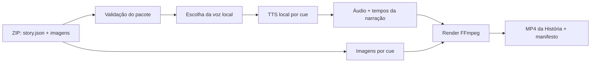

# Desenvolvimento — modo História

## Escopo

História é uma produção independente dos fluxos de Cena, Música e Anki.
Um projeto História recebe um único ZIP com imagens e um JSON estruturado. O
Generator valida o pacote, usa a voz local escolhida para narrar cada cue e
renderiza um MP4 didático com imagem, voz e marcações de aprendizado.

Não há download de YouTube, ASR, cue review de vídeo externo ou dependência de
Groq nesse modo. O vídeo final é publicado no YouTube pelo operador e então
importado no site como conteúdo independente **Text + Audio · Story**.



## Entrada ZIP

O ZIP deve conter apenas arquivos de história. Não pode conter caminhos
absolutos, `..`, symlinks, executáveis ou arquivos que não pertençam ao
contrato. A extração ocorre em diretório temporário e somente arquivos
validados são copiados ao workspace do projeto.

Estrutura mínima:

```text
my-story.zip
  story.json
  images/
    001.jpg
    002.jpg
    003.png
```

Restrições iniciais recomendadas:

- `story.json` obrigatório e único;
- imagens JPG, PNG ou WebP;
- no máximo 80 imagens, 20 MB por imagem e 200 MB por ZIP;
- imagens com no máximo 40 megapixels;
- cada imagem declarada no JSON deve existir dentro do ZIP;
- imagens não declaradas podem ser rejeitadas para evitar pacote ambíguo.

## Contrato de story.json de entrada

Cada cue é uma unidade visual, narrativa e didática. A imagem fica associada à
cue; o texto EN é a fonte da narração; a tradução e os destaques são usados
para a legenda sobre o vídeo.

```json
{
  "schema": "generator-story",
  "schema_version": "1.0",
  "title": "The Lost Key",
  "language": "en",
  "aspect_ratio": "9:16",
  "cues": [
    {
      "order": 1,
      "image": "images/001.jpg",
      "en": "Maya found an old key under the stairs.",
      "pt": "Maya encontrou uma chave antiga sob as escadas.",
      "highlights": [
        {
          "text": "found",
          "type": "important_word",
          "pt": "encontrou",
          "occurrence": 1
        },
        {
          "text": "under the stairs",
          "type": "structure",
          "pt": "sob as escadas",
          "occurrence": 1
        }
      ]
    },
    {
      "order": 2,
      "image": "images/002.jpg",
      "en": "She picked it up and looked around.",
      "pt": "Ela a pegou e olhou ao redor.",
      "highlights": [
        {
          "text": "picked up",
          "type": "phrasal_verb",
          "pt": "pegou",
          "occurrence": 1
        }
      ]
    }
  ]
}
```

Campos obrigatórios por cue: `order`, `image`, `en`, `pt` e `highlights`.
`order` deve começar em 1, ser único e contínuo. Os tipos aceitos na primeira
versão são `important_word`, `structure` e `phrasal_verb`.

`text` de cada destaque deve ocorrer literalmente no campo `en` da mesma cue.
`occurrence` elimina ambiguidade quando o texto se repete. A validação deve
identificar a ocorrência exata sem alterar maiúsculas, acentos ou pontuação do
texto original.

## Escolha de voz

Na criação do projeto História, o usuário escolhe um perfil de voz local já
existente ou cria um novo perfil pelo fluxo de Chatterbox Nano. A escolha é
feita antes de renderizar e fica congelada no projeto:

```json
{
  "voice_profile_id": "voice_01hr...",
  "voice_profile_revision_sha256": "...",
  "voice_profile_name": "Narradora clara"
}
```

Todas as cues de uma História usam esse mesmo snapshot. Uma mudança de voz
depois da primeira renderização cria uma nova revisão de produção; ela não
substitui os WAVs e o MP4 já concluídos.

## Geração da narração

O Chatterbox Nano gera um WAV por cue. A chave do cache considera:

```text
texto EN da cue + perfil de voz + revisão do perfil + modelo + parâmetros
```

Os WAVs são normalizados para o mesmo formato antes da montagem. O manifest
registra para cada cue o texto literal, hash do WAV, início, fim e duração da
narrativa. Tempos de palavras não são obrigatórios neste primeiro contrato;
os destaques didáticos acompanham a cue inteira. Uma futura versão pode aceitar
alinhamento por palavra sem invalidar o JSON v1.

```json
{
  "cue_order": 2,
  "audio": "audio/cue_0002.wav",
  "audio_sha256": "...",
  "start_ms": 4350,
  "end_ms": 7510
}
```

## Renderização do vídeo

Para cada cue, o renderer monta um segmento com:

- a imagem associada, em modo `cover` para a proporção escolhida;
- movimento visual leve e determinístico (zoom/pan) opcional;
- a narração WAV da cue;
- legenda EN literal;
- legenda PT literal;
- realce didático dos `highlights` na cue.

Os segmentos são unidos por FFmpeg, preservando a ordem dos cues. O MP4 final
deve usar H.264 + AAC e `+faststart`. O output inclui o vídeo, os WAVs e o
manifesto de produção; o projeto pode ser reaberto e renderizado de novo sem
regerar áudios que permanecem válidos no cache.

## Experiência de edição

A primeira versão precisa permitir revisão antes do render final:

- lista lateral com cue, miniatura, texto EN/PT e destaques;
- preview da imagem e da locução da cue;
- seleção de uma voz existente ou criação de uma nova voz;
- edição de EN/PT e dos destaques, com validação imediata da ocorrência;
- substituição da imagem de uma cue;
- renderização de preview de uma cue e renderização final da História inteira.

Editar `en` invalida somente o WAV e o segmento daquela cue. Editar `pt`,
destaques ou imagem não deve regenerar a voz, mas exige nova renderização do
segmento de vídeo correspondente.

## Contrato de saída para o site

O site não lê o ZIP de entrada, nem os WAVs, nem o JSON de trabalho do
Generator. O Generator deve produzir um JSON final separado, compatível com o
importador Admin Text + Audio do repositório `ihub-english`:

```json
{
  "schema": "immersionhub-text-audio",
  "schema_version": "1.1",
  "mode": "story",
  "title": "The Lost Key",
  "description": "Uma história curta para praticar phrasal verbs.",
  "youtubeUrl": "https://www.youtube.com/watch?v=ID_VALIDADO",
  "youtubeVideoId": "ID_VALIDADO",
  "durationMs": 7510,
  "cues": [
    {
      "order": 1,
      "startMs": 0,
      "endMs": 4350,
      "en": "Maya found an old key under the stairs.",
      "pt": "Maya encontrou uma chave antiga sob as escadas.",
      "highlights": []
    }
  ]
}
```

O operador publica `story_final.mp4` no YouTube e informa a URL/ID no
Generator. O Generator valida o ID antes de escrever o JSON final e não faz
upload automático. O Admin do site importa esse JSON, persiste cues em
`text_audio_items`/`text_audio_cues` e o player público usa exclusivamente a
fonte YouTube.

## Artefatos finais

```text
story_final.mp4
story_manifest.json
story_source.json
audio/cue_0001.wav
audio/cue_0002.wav
story_package.zip
```

`story_manifest.json` registra a versão do contrato, a voz, hashes das imagens,
hashes dos WAVs, tempos de cues e o hash do MP4. O pacote ZIP contém todos os
artefatos necessários para auditoria e reprodução local.

O pacote também inclui `text_audio_final.json`, que só é gerado após informar
uma URL/ID YouTube válido. Esse é o único JSON destinado à importação no site.

## Critérios de aceite

- Um ZIP válido produz um projeto História independente.
- Cada cue usa a imagem declarada e a voz selecionada.
- A narração de todas as cues usa a mesma revisão de perfil de voz.
- Texto EN/PT e pontuação da entrada aparecem literalmente nas legendas.
- Destaques inexistentes ou ambíguos impedem a importação e apontam cue/campo.
- A alteração de uma cue invalida apenas seus artefatos dependentes.
- O MP4 final respeita a ordem das cues e contém áudio em toda a duração.
- O JSON final usa `immersionhub-text-audio` v1.1, `mode: story`, um ID
  YouTube válido e cues com `startMs/endMs`, `en`, `pt` e `highlights`.
- Nenhuma chamada Groq é feita para a narração.

## Limites desta primeira versão

O modo História não cria Anki, não faz upload automático ao YouTube, não extrai
vídeo de YouTube e não faz alinhamento automático Word by Word. Esses recursos podem ser
adicionados depois por versões explícitas do contrato.
## Reprodução, qualidade e rastreabilidade

### Cadeia de proveniência

Cada renderização de História recebe um `production_id` imutável. O manifesto
associa cada artefato a sua entrada e dependências:

```text
story_source.json + hashes das imagens + snapshot do perfil de voz
  -> WAV por cue + hash/duração
  -> segmento por cue + hash/duração
  -> story_final.mp4 + hash/duração
  -> text_audio_final.json + video_id/URL confirmados
```

O editor pode criar uma nova revisão, mas não altera silenciosamente uma
produção concluída. Isso permite reproduzir um vídeo antigo, comparar duas
narradoras e investigar uma diferença de timing com os mesmos dados de origem.

### Jobs e atualizações parciais

A renderização ocorre como job persistente nos estados `queued`, `validating`,
`synthesizing`, `rendering_segments`, `assembling`, `awaiting_youtube_link`,
`completed`, `failed` e `cancelled`. O progresso é granular por cue e cada
falha informa cue, imagem ou campo JSON causador.

Ao editar uma cue, o sistema calcula dependências: mudança em `en` invalida WAV
e segmento; mudança em imagem, `pt` ou `highlights` invalida somente o
segmento; mudança do perfil invalida os WAVs e segmentos da nova revisão. A
montagem final reaproveita segmentos válidos. Retomar um job confirma hashes e
durações existentes antes de continuar, sem ocultar ou apagar a produção
anterior.

### Qualidade do pacote e do render

Antes de renderizar, além da validação do ZIP, verificar que EN/PT não estão
vazios, que não há duplicidade de ordem e que cada destaque referencia uma
ocorrência inequívoca no texto EN literal. O editor deve mostrar o trecho que
foi reconhecido, inclusive quando a mesma expressão ocorre mais de uma vez.

Antes de entregar, FFprobe valida que `story_final.mp4` contém vídeo H.264 e
áudio AAC, tem duração suficiente para o último cue, e pode ser decodificado
em amostras do início, meio e fim. O manifesto confere que os segmentos não se
sobrepõem, não deixam lacunas involuntárias e respeitam a ordem. A revisão
humana aprova pelo menos a prévia de uma cue por imagem, a primeira/última cue
e todos os destaques marcados como didaticamente relevantes.

### Contrato com o iHub e publicação

`text_audio_final.json` é um contrato versionado. A exportação deve conter um
exemplo validado contra o schema e fixtures mantidas em comum com o importador
do iHub: sucesso, `youtubeVideoId` inválido, tempos fora de `durationMs`, ordem
duplicada e destaque não encontrado. Uma mudança de schema só é liberada junto
com a compatibilidade do importador e um teste real de importação.

O operador publica o MP4 e retorna ao Generator para informar o link. Antes de
emitir o JSON final, o Generator registra `production_id`, hash e duração do
MP4 local, URL/ID, data e responsável pela confirmação. A validação do formato
do ID impede entradas malformadas; a confirmação humana garante que o vídeo
publicado é a revisão que recebeu os timings exportados.

Logs JSON podem conter IDs, durações, hashes e etapa do job. Não devem gravar
conteúdo integral da referência de voz, nem o ZIP original fora do diretório de
produção autorizado. Métricas úteis incluem taxa de ZIP inválido, taxa de
reaproveitamento de WAV/segmento, tempo de render por minuto de vídeo e falhas
de importação no iHub.

## Decisões fechadas

- História é independente de Cena, Música, download de YouTube, ASR e Anki.
- O mesmo perfil local selecionado é congelado para toda a produção, por
  revisão.
- O JSON de trabalho do Generator não é consumido pelo site; somente
  `text_audio_final.json` é importável.
- O vídeo é publicado manualmente no YouTube e a URL/ID é vinculada sem upload
  automático pelo Generator.
