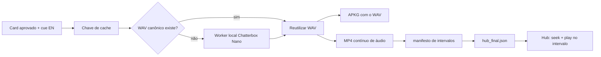

# Desenvolvimento — TTS local único para Anki e Hub

## Objetivo

Substituir a geração de voz dos cards Anki, hoje feita pela Groq, por geração
local com **Chatterbox Nano**. Cada texto deve gerar um único WAV canônico. O
mesmo WAV deve ser usado em dois destinos:

1. dentro do APKG baixado pelo usuário;
2. em um MP4 de áudio contínuo, usado pelo Hub ao tocar um card.

O Hub não deve gerar uma voz nova e não deve receber outro WAV para o mesmo
card. Ao tocar um card, ele busca o intervalo desse card no MP4 contínuo. Isso
garante que a locução seja a mesma, inclusive quando houver pausas, pronúncia
ou entonação particulares.

## Situação atual

O fluxo atual gera até quatro versões de cada cue (`diana`, `hannah`, `troy` e
`austin`) pela Groq. Cada versão é salva em `materials_tts/tts/<voz>/cue_NNNN.wav`
e gera um APKG separado. O JSON final do Hub não referencia esses áudios.

Essa estrutura cria dois problemas:

- depende de uma API externa para o conteúdo de voz;
- não existe uma ligação entre o áudio entregue no Anki e o áudio que o Hub
  precisa reproduzir.

## Decisão de arquitetura

Usar um perfil de voz local por geração final. O perfil possui um identificador
estável, os parâmetros de síntese e, opcionalmente, um arquivo de referência
para clonagem de voz. O Chatterbox Nano deve rodar isolado do processo da API,
em ambiente Python próprio, porque PyTorch/Torchaudio e os pesos do modelo são
pesados.



## Perfil de voz local

O perfil deve ser único para cada exportação. A primeira versão pode oferecer
um perfil padrão e um perfil com referência de voz.

```json
{
  "provider": "local_chatterbox_nano",
  "model": "chatterbox-nano",
  "model_revision": "versão instalada do pacote/modelo",
  "profile_id": "default" ,
  "reference_audio_sha256": "hash do WAV de referência ou vazio",
  "device": "cuda|cpu",
  "sample_rate_hz": 24000
}
```

O arquivo de referência é opcional. Sem ele, o modelo usa a voz base do
Chatterbox Nano. Com ele, o mesmo arquivo de referência deve ser usado para
todas as sínteses da exportação.

O modelo e o cache Hugging Face ficam fora de `workspace/`, por exemplo em
`C:\generator\.tts-runtime\hf-cache`. Projetos e exports não carregam cópias
dos pesos do modelo.

## Biblioteca de vozes local

A área de geração de vozes deve oferecer duas ações explícitas antes de gerar
os materiais:

1. **Escolher voz existente:** selecionar uma voz já sintetizada e aprovada na
   biblioteca local.
2. **Sintetizar nova voz:** criar um novo perfil a partir de uma amostra de
   referência e de parâmetros do Chatterbox Nano.

Uma voz criada não é o WAV de um card: é um perfil de síntese reutilizável. Os
WAVs dos cards continuam sendo gerados a partir do perfil escolhido e entram no
cache por conteúdo.

Estrutura local proposta:

```text
settings/local_tts/
  voices.json
  voices/
    voice_01hr.../
      profile.json
      reference.wav
      preview.wav
```

Exemplo de `profile.json`:

```json
{
  "id": "voice_01hr...",
  "name": "Narradora clara",
  "status": "ready",
  "provider": "local_chatterbox_nano",
  "reference_audio_sha256": "...",
  "preview_audio": "preview.wav",
  "created_at_utc": "2026-09-21T17:00:00Z",
  "last_used_at_utc": "2026-09-21T17:30:00Z",
  "usage_count": 3,
  "settings": {
    "language": "en",
    "exaggeration": 0.5,
    "cfg_weight": 0.5
  }
}
```

Ao criar uma nova voz, o fluxo é:

1. enviar uma referência de voz válida;
2. normalizar a referência para WAV local e calcular o hash;
3. gerar uma prévia com uma frase fixa de teste;
4. permitir ouvir a prévia, nomear e salvar o perfil;
5. registrar o perfil no histórico como `ready`;
6. selecionar essa voz para a geração atual somente após ela ser salva.

O histórico é um catálogo, não um cache descartável. Apagar uma voz deve ser
uma ação explícita e só pode remover seu perfil quando nenhum projeto/export
ativo depender dela. Os WAVs de card existentes permanecem reproduzíveis por
seus próprios hashes e manifestos mesmo se uma voz deixar de estar disponível
para novas sínteses.

O projeto salva um snapshot mínimo da escolha:

```json
{
  "tts_voice_profile_id": "voice_01hr...",
  "tts_voice_name": "Narradora clara",
  "tts_voice_revision_sha256": "..."
}
```

O manifest da geração final repete esse snapshot. Desse modo, Anki e Hub usam
o mesmo perfil e os mesmos WAVs, enquanto o histórico continua livre para
receber novas vozes depois.

## Worker isolado

O servidor FastAPI não deve importar PyTorch, Torchaudio ou Chatterbox. A API
chama um worker por processo com um pedido JSON contendo texto, caminho de
saída, perfil e cache Hugging Face.

Responsabilidades do worker:

- detectar `cuda` quando disponível e usar CPU quando não estiver;
- carregar `ChatterboxTurboTTS.from_pretrained(..., nano=True)`;
- aplicar o mesmo `audio_prompt_path` para o perfil que usa referência;
- escrever WAV PCM com sample rate conhecido;
- devolver duração, sample rate, hash SHA-256, modelo e perfil;
- apresentar erro explícito se o runtime local ou os pesos não estiverem
  instalados.

O processo deve ser reutilizado em uma geração de materiais, para o modelo ser
carregado uma vez. Se for implementado inicialmente como subprocesso por
arquivo, a interface deve manter esse detalhe escondido para permitir uma
evolução posterior para worker persistente.

## Chave de cache

O cache deve ser por conteúdo, não por número do cue nem por data da aprovação.

```text
SHA-256(
  texto EN normalizado para síntese +
  profile_id +
  hash da referência +
  modelo + revisão do modelo + parâmetros de geração
)
```

O texto editorial armazenado em `approved_en` é a entrada de síntese. O cache
não pode remover apóstrofos, pontuação ou acentuação antes de calcular a chave.
Uma mudança de texto ou de perfil gera novo WAV; uma nova aprovação sem mudança
reutiliza o WAV existente.

Estrutura proposta:

```text
workspace/materials_tts/
  cache/<sha256>.wav
  cards/cue_0001.wav
  cards/cue_0004.wav
  tts_manifest.json
  anki_tts_timeline.mp4
  anki_tts_timeline.json
```

`cards/cue_NNNN.wav` pode ser hard link/cópia do cache quando o sistema de
arquivos permitir. O manifest deve guardar o hash do arquivo efetivamente
empacotado no Anki.

## MP4 contínuo, YouTube e sincronização

O arquivo `anki_tts_timeline.mp4` terá quadro preto simples e áudio AAC. As
faixas WAV dos cards entram na ordem crescente de `cue_order`, sem recompressão
intermediária antes da montagem final.

O ImmersionHub não hospeda esse MP4 nem toca um arquivo local no runtime. O
operador publica o reel no YouTube e informa a URL/ID no Generator. O Generator
apenas valida a URL/ID e grava esse identificador no JSON final; ele não faz
upload automático.

O gerador deve produzir também `anki_tts_timeline.json`, que é a fonte da
sincronização:

```json
{
  "schema": "immersionhub-anki-tts-timeline",
  "schema_version": "1.0",
  "asset": "anki_tts_timeline.mp4",
  "voice_profile": {
    "provider": "local_chatterbox_nano",
    "profile_id": "default"
  },
  "entries": [
    {
      "cue_order": 4,
      "audio_filename": "cue_0004.wav",
      "audio_sha256": "...",
      "start_ms": 3250,
      "end_ms": 5620,
      "duration_ms": 2370
    }
  ]
}
```

Os tempos devem vir das durações dos WAVs normalizados e ser confirmados pelo
arquivo final. O gerador deve executar `ffprobe` no MP4 e verificar que a
duração final cobre o último `end_ms`. Uma pequena tolerância de encoder pode
ser aceita na validação de duração do arquivo, mas os offsets publicados são os
offsets que o player usa.

Para evitar corte no fim, cada entrada recebe uma margem interna de segurança
apenas no MP4: o Hub toca até `end_ms`, nunca até o final do arquivo. A margem
não entra no WAV do APKG nem na duração editorial do card.

## Contrato no hub_final.json

O site já consome um reel dedicado do YouTube. Portanto o JSON final deve usar
o contrato existente `ankiAudio.youtube.video_id` + `ankiAudio.cues[]`; não
deve introduzir um URL de MP4 local como fonte de reprodução:

```json
{
  "ankiAudio": {
    "youtube": {
      "video_id": "ID_VALIDADO_DO_YOUTUBE"
    },
    "cues": [
      {
        "cue_order": 4,
        "start_ms": 3250,
        "end_ms": 5620,
        "voice_id": "voice_01hr...",
        "voice_name": "Narradora clara",
        "variant_index": 0
      }
    ]
  },
  "cues": [
    {
      "order": 4,
      "anki": { "include": true, "items": [] }
    }
  ]
}
```

Todos os cards vinculados à mesma cue usam o mesmo intervalo, pois o fluxo
atual gera a locução por cue. O importador do Hub recupera os intervalos a
partir do bloco superior `ankiAudio.cues[]` e os persiste nos cards. O áudio
principal de Card usa somente esse reel dedicado; o áudio da cena original é
um controle de contexto separado.

No Hub, o comportamento do botão de áudio é:

1. carregar ou reutilizar o player YouTube do reel;
2. definir `currentTime = start_ms / 1000`;
3. iniciar a reprodução;
4. interromper quando `currentTime >= end_ms / 1000`;
5. reiniciar a partir de `start_ms` se o usuário clicar novamente.

O Hub deve ler os tempos do JSON e nunca estimar duração pelo texto.

## Artefatos de entrega

O ZIP final deverá incluir:

- `hub_final.json` com `ankiAudio.youtube.video_id` após o reel ser publicado;
- `anki_tts_timeline.mp4`;
- `anki_tts_timeline.json`;
- `materials_tts_audio.zip`, com WAVs e manifest técnico;
- um APKG com a voz local única;
- APKG sem áudio, quando esse variante continuar habilitado.

O operador publica o MP4 no YouTube e informa a URL no Generator antes de
exportar o JSON final. A validação deve recusar um JSON com cues de Anki sem
um `youtube.video_id` válido e deve conferir que toda cue Anki possui um
intervalo recuperável no reel.

## Mudanças de interface

Substituir o painel atual de configuração Groq para TTS por um painel
**Voz local**:

- status do runtime Chatterbox Nano;
- seletor de vozes existentes, com prévia e indicação da voz ativa;
- lista de vozes locais para buscar, ouvir e reutilizar perfis já sintetizados;
- ação **Sintetizar nova voz**, com upload de referência, prévia, nome e
  salvamento do perfil;
- perfil ativo e a revisão exata salva no projeto;
- informação de dispositivo selecionado (GPU/CPU);
- botão de teste local;
- ação para limpar somente o cache do perfil, com confirmação explícita.

A configuração Groq pode permanecer separada para funções editoriais opcionais,
mas não deve bloquear o fluxo de materiais nem o botão de geração de TTS.

Na tela de materiais finais, trocar "Groq TTS" por "Voz local" e exibir o
perfil, a quantidade de WAVs reutilizados/gerados e o MP4 de timeline entre os
artefatos de Hub.

## Plano de implementação

1. Criar runtime isolado e worker Chatterbox Nano com cache Hugging Face local.
2. Criar a biblioteca persistente de vozes e prévias.
3. Adicionar escolha de voz existente e síntese de perfil novo por referência.
4. Trocar `_materials_tts_for_approved` por geração de um WAV local por cue.
5. Remover variantes de voz Groq e gerar um APKG com a voz do perfil ativo.
6. Gerar MP4 contínuo e manifesto com intervalos após os WAVs.
7. Estender `build_hub_final_json` com `ankiAudio` e a referência de timing por
   cue, sem quebrar imports de JSON antigos.
8. Incluir MP4 e manifesto no pacote final e nos endpoints de download.
9. Atualizar a tela de configuração e a de materiais finais.

## Critérios de aceite

- A geração de materiais com cards aprovados não faz chamadas à Groq para TTS.
- Uma voz existente pode ser selecionada sem nova síntese.
- Uma voz nova só aparece como selecionável após prévia válida e perfil salvo.
- O projeto e o manifest final registram a mesma revisão do perfil selecionado.
- Repetir uma geração sem mudar texto/perfil reutiliza os mesmos WAVs.
- O hash do WAV em um APKG é o hash publicado no manifest do Hub.
- Cada `start_ms/end_ms` está dentro da duração do MP4 e segue a ordem dos
  cards.
- O botão de áudio do Hub toca somente o intervalo indicado no reel YouTube.
- Falta do runtime Chatterbox, do modelo ou do FFmpeg produz mensagem clara e
  não invalida PDF/JSON/APKG sem áudio.
- O ZIP final contém o MP4, o manifest e o JSON que os referencia.

## Arquivos que serão afetados na implementação

- `C:\generator\tts_service.py` ou novo serviço local de TTS;
- novo worker isolado para Chatterbox Nano;
- `C:\generator\app.py`, na geração de TTS, cache e artefatos;
- `C:\generator\materials_final.py`, no MP4, manifest e `hub_final.json`;
- `C:\generator\anki_generator.py`, no rótulo de origem da voz;
- `C:\generator\static\config.html` e `config_groq.js`, para a configuração
  local;
- `C:\generator\static\materials_final.*`, para status e downloads;
- testes de cache, hashes, manifesto, MP4 e contrato Hub.

## Fora do escopo desta etapa

Nenhum runtime, dependência, áudio, configuração, endpoint ou contrato JSON foi
alterado nesta etapa. Este documento descreve a implementação futura.
## Integridade, observabilidade e recuperação

### Invariantes de produção

A entrega só pode ser marcada como pronta quando todas estas relações forem
verdadeiras:

1. cada `cue_order` incluída no Anki possui exatamente um WAV canônico,
   identificado pelo seu SHA-256;
2. o WAV empacotado no APKG, a entrada do manifesto e o trecho no reel derivam
   do mesmo hash de áudio;
3. os intervalos `start_ms/end_ms` do `hub_final.json` são iguais aos do
   `anki_tts_timeline.json` que gerou o MP4;
4. cada intervalo está contido na duração medida por `ffprobe` no reel final;
5. o perfil e sua revisão, modelo e parâmetros usados permanecem registrados
   no manifest, mesmo quando o perfil for posteriormente arquivado;
6. um `video_id` informado pelo operador pertence ao reel que foi revisado.

O sexto item requer uma confirmação explícita no fluxo de exportação: o
Generator mostra o hash/duração do MP4 local e registra a URL/ID YouTube,
data e usuário da vinculação. A validação automática de formato do ID não
prova que o upload seja o arquivo correto; a confirmação evita publicar tempos
contra um reel diferente.

### Estado e reprocessamento

A geração deve ser registrada como job persistente, com estados
`queued`, `synthesizing`, `assembling_reel`, `awaiting_youtube_link`,
`validating`, `completed`, `failed` e `cancelled`. O job registra progresso por
cue, erro normalizado e caminhos dos artefatos parciais.

Uma falha não deve apagar WAVs válidos nem exigir nova síntese. Ao retomar, o
worker confirma hash, formato e duração dos artefatos existentes e processa
somente as entradas faltantes ou inválidas. A publicação da URL YouTube é uma
etapa separada e repetível: trocar a URL não gera voz nem reconstrói o MP4,
mas exige nova confirmação de vinculação e novo `hub_final.json`.

### Validações de qualidade de áudio e mídia

Antes do APKG e do reel, o pipeline valida por WAV:

- arquivo decodificável, mono e sample rate do perfil;
- duração acima de zero e abaixo do limite por cue;
- ausência de clipping sustentado e de silêncio integral;
- hash e duração gravados após a normalização final.

Após o MP4, valida com FFprobe codec H.264/AAC, presença de fluxos de vídeo e
áudio, duração, `start_time` esperado e possibilidade de seek nos primeiros,
intermediários e últimos intervalos. Uma amostragem de ondas/RMS por intervalo
serve para detectar concatenação silenciosa. Essas verificações bloqueiam
somente o artefato afetado; PDF, JSON sem áudio ou APKG sem áudio continuam
exportáveis quando seus próprios contratos forem válidos.

### Contratos versionados e testes cruzados

`anki_tts_timeline.json` e o bloco `ankiAudio` devem ter schemas JSON
versionados e exemplos fixos de sucesso e falha. Generator e iHub mantêm a
mesma coleção de fixtures: reel válido, intervalo fora da duração, cue sem
áudio, hash divergente e `video_id` ausente. Uma alteração de schema exige:

1. nova versão explícita ou regra documentada de compatibilidade;
2. atualização do importador do iHub e do exportador do Generator;
3. teste de exportação e importação de ponta a ponta;
4. plano de leitura para exports já publicados.

Logs JSON devem incluir `project_id`, `job_id`, `cue_order`, chave de cache,
`voice_profile_id`, duração e resultado, sem registrar a referência de voz nem
texto completo de usuários. Métricas mínimas: cache hit, tempo de síntese por
segundo de áudio, falhas por etapa, duração final e taxa de validação do reel.

## Decisões fechadas

- A unidade canônica é o WAV por cue, e nunca um áudio regravado para o Hub.
- O MP4 é um artefato de distribuição/publicação; o manifesto é a fonte
  autoritativa dos seus tempos.
- A URL/ID do YouTube é vinculada por operador e validada pelo Generator; não
  há upload automático.
- Vozes são perfis reutilizáveis e versionados; não pertencem a um projeto,
  enquanto os snapshots de uso pertencem.
